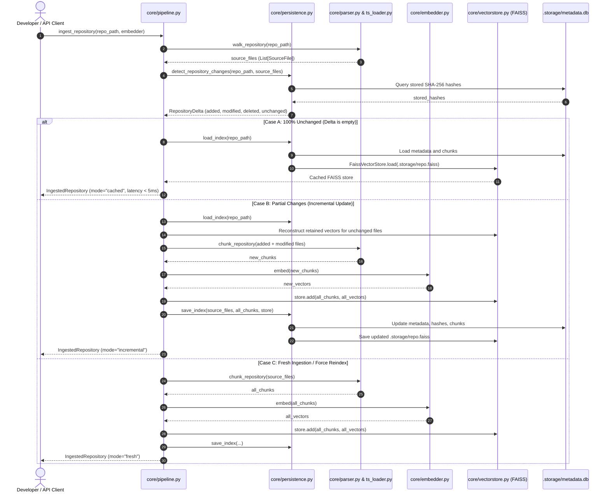
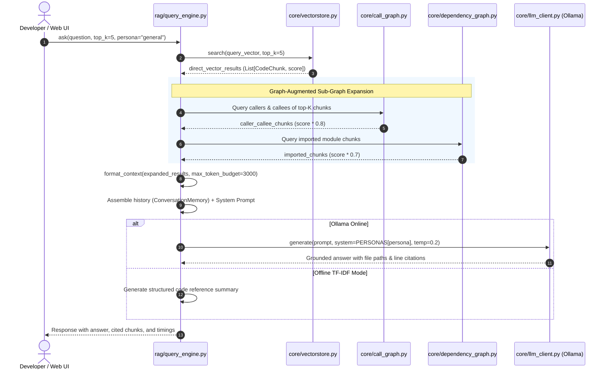
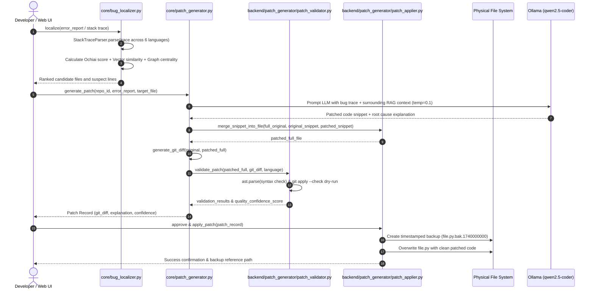

# IntelliCodeX — System Architecture & Technical Design

> **Document Version**: 1.0.0  
> **Status**: Verified & Grounded in Inspected Codebase  
> **Repository Target**: `intellicodex`

---

## 1. Architectural Overview & System Decomposition

IntelliCodeX is structured as a modular, three-tier local architecture:
1. **Presentation Layer**: Interactive Terminal UI ([`cli.py`](file:///c:/Users/vikas/Downloads/Major%20project%202%202026/intellicodex/cli.py)) serving as the primary developer interface for Semester 1. Full Web Application UI is preserved in the Semester 2 roadmap.
2. **Application & Service Layer**: Modular FastAPI REST server ([`backend/main.py`](file:///c:/Users/vikas/Downloads/Major%20project%202%202026/intellicodex/backend/main.py)) providing endpoints for authentication, repository management, RAG chat, bug localization, patch generation, graph topology, analytics, and documentation.
3. **Core Intelligence & Storage Layer**: High-performance multi-language Tree-Sitter AST parsers, NetworkX dependency and call-graph engines, dual embedding generators (`OllamaEmbedder` + `TfidfEmbedder`), FAISS vector index, SQLite metadata store (`.storage/metadata.db`), and local disk store (`.storage/db.json`).

```mermaid
graph TD
    subgraph Presentation_Layer [Presentation Layer (Active: CLI)]
        CLI["Interactive CLI (cli.py)"]
        WebUIFuture["[Future Phase] React / Next.js Web UI"]
    end

    subgraph Service_Layer [Service & API Layer (FastAPI)]
        MainAPI["backend/main.py (Port 8000)"]
        LegacyBridge["server/api.py (Legacy Bridge)"]
        AuthRouter["/api/auth (JWT)"]
        RepoRouter["/api/repos (Ingest/Sync)"]
        ChatRouter["/api/chat (RAG Assistant)"]
        BugRouter["/api/bugs (Ochiai SBFL)"]
        PatchRouter["/api/patches (Diff Engine)"]
        GraphRouter["/api/graph (Cytoscape Export)"]
        AnalyticsRouter["/api/analytics"]
        DocRouter["/api/docs"]
        ReviewRouter["/api/review"]
    end

    subgraph Core_Engine [Core Intelligence Engine]
        Parser["core/parser.py & core/ts_loader.py"]
        TSChunker["core/tree_sitter_chunker.py"]
        DepGraph["core/dependency_graph.py (NetworkX)"]
        CallGraph["core/call_graph.py (NetworkX)"]
        DualEmbedder["core/embedder.py (Ollama / TF-IDF)"]
        QueryEngine["rag/query_engine.py"]
        BugLocalizer["core/bug_localizer.py (Ochiai + Trace)"]
        PatchEngine["core/patch_generator.py & patch_applier.py"]
    end

    subgraph Persistence_Layer [Persistence & Cache Layer]
        SQLiteDB[".storage/metadata.db (SQLite)"]
        FAISSIndex[".storage/*.faiss (FAISS Binary)"]
        DiskStore[".storage/db.json (Local JSON Store)"]
        MongoDB["MongoDB (Optional Daemon)"]
    end

    subgraph External_Local_Services [External Local Daemon]
        OllamaServer["Local Ollama Server (Port 11434)<br/>• qwen2.5-coder<br/>• nomic-embed-text"]
    end

    CLI --> Core_Engine
    WebUIFuture -.-> MainAPI
    MainAPI --> AuthRouter & RepoRouter & ChatRouter & BugRouter & PatchRouter & GraphRouter & AnalyticsRouter & DocRouter & ReviewRouter
    LegacyBridge --> MainAPI
    RepoRouter & ChatRouter & BugRouter & PatchRouter --> Core_Engine
    Core_Engine --> SQLiteDB & FAISSIndex
    MainAPI --> DiskStore
    DiskStore -.-> MongoDB
    DualEmbedder -.-> OllamaServer
    QueryEngine -.-> OllamaServer
    PatchEngine -.-> OllamaServer
```

---

## 2. Technology Stack & Entry Points

### 2.1 Technology Stack Matrix

| Subsystem | Technology / Library | Version | Role in Architecture |
| :--- | :--- | :--- | :--- |
| **Runtime** | Python | `>= 3.10` (Tested on 3.12/3.14) | Core backend, pipeline, and CLI execution |
| **Primary Interface**| Interactive CLI (`cli.py`) | Version 1.0.0-sem1 | Interactive terminal assistant, batch query, benchmarks |
| **API Server** | FastAPI, Uvicorn, Pydantic | `fastapi>=0.110`, `uvicorn>=0.27` | High-throughput async REST server |
| **AST Parsers** | Tree-Sitter (`tree-sitter-*`) | `tree-sitter>=0.22.0` | Multi-language syntax tree semantic chunking |
| **Vector Index** | FAISS CPU (`faiss-cpu`) | `>= 1.7.4` | Inner-product cosine similarity vector search |
| **Graph DB** | NetworkX (`networkx`) | `>= 3.0` | In-memory directed graphs for imports and call graphs |
| **Embeddings** | Ollama API / Scikit-Learn | `scikit-learn>=1.3` | Dual dense neural + offline TF-IDF SVD fallback |
| **LLM Inference**| Ollama (`qwen2.5-coder`) | Local Server (HTTP 11434) | Grounded RAG synthesis and patch generation |
| **Relational DB**| SQLite3 (`sqlite3`) | Standard Library | File hash caching and chunk relational metadata |
| **Document DB** | PyMongo / Local JSON Store | `pymongo` (optional) | User accounts, chat logs, bug reports, patches |
| **Future Web UI**| React 18, Vite 5, Tailwind CSS | Preserved for Semester 2 | Full web dashboard workspace |

### 2.2 Application Entry Points

1. **Standalone CLI (Primary Interface)**:
   - [`cli.py`](file:///c:/Users/vikas/Downloads/Major%20project%202%202026/intellicodex/cli.py)
   - Invocation: `python cli.py [repo_path] [--backend ollama|tfidf]` or Windows launcher [`run_cli.bat`](file:///c:/Users/vikas/Downloads/Major%20project%202%202026/intellicodex/run_cli.bat).
2. **FastAPI Enterprise Backend (Local API Server)**:
   - [`backend/main.py`](file:///c:/Users/vikas/Downloads/Major%20project%202%202026/intellicodex/backend/main.py)
   - Invocation: `uvicorn backend.main:app --host 0.0.0.0 --port 8000 --reload` or Windows launcher [`run_backend.bat`](file:///c:/Users/vikas/Downloads/Major%20project%202%202026/intellicodex/run_backend.bat).
3. **Legacy FastAPI Bridge**:
   - [`server/api.py`](file:///c:/Users/vikas/Downloads/Major%20project%202%202026/intellicodex/server/api.py)
   - Mounts legacy endpoints (`/ingest`, `/query`, `/localize_bug`, `/dependencies`) pointing directly to `backend.main.app`.
4. **Interactive Launcher**:
   - [`run.bat`](file:///c:/Users/vikas/Downloads/Major%20project%202%202026/intellicodex/run.bat) (Menu to launch CLI with Ollama/TF-IDF, Backend Server, Docker, or Install Dependencies).

---

## 3. Detailed Component Architecture & Responsibilities

### 3.1 Code Ingestion & Multi-Language Parsing (`core/parser.py`, `core/ts_loader.py`, `core/tree_sitter_chunker.py`)
- **`walk_repository(repo_path)`**: Recursively traverses the directory tree, applying `.gitignore` filtering rules via fnmatch, filtering binaries, and instantiating `SourceFile` objects.
- **`TreeSitterLoader`**: Dynamically initializes Tree-Sitter language instances for Python, JavaScript, TypeScript, Java, C, C++, Go, and Rust.
- **`TreeSitterChunker`**: Traverses AST nodes, extracting functions, methods, classes, structs, interfaces, and docstrings.
- **`chunk_repository(files)`**: Coordinates Tree-Sitter chunkers across source files, falling back to windowed line chunking for unsupported formats or malformed files.

### 3.2 Graph Analysis Subsystem (`core/dependency_graph.py`, `core/call_graph.py`)
- **`build_dependency_graph(source_files)`**: Uses regex and import visitor logic to detect cross-file imports across ES6 JS/TS (`import ... from '...'`), Java (`import com.pkg.*`), C/C++ (`#include "..."`), and Python (`import x`, `from x import y`).
- **`build_call_graph(chunks, source_files)`**: Analyzes function definitions and body call sites to build directed caller-callee edges between functions.
- **`files_likely_affected_by(graph, file_path)`**: Computes reverse topological reachability to determine the "blast radius" when a file is modified.
- **`get_top_central_files()` / `get_top_central_symbols()`**: Executes PageRank on import and call graphs to identify architectural choke points.

### 3.3 Dual Embedding & Vector Indexing (`core/embedder.py`, `core/vectorstore.py`)
- **`OllamaEmbedder`**: Communicates with `http://localhost:11434/api/embeddings` using model `nomic-embed-text` to produce 768-dimensional dense vectors.
- **`TfidfEmbedder`**: Offline fallback using `TfidfVectorizer` and `TruncatedSVD` (64 dimensions) for zero-dependency CPU environments.
- **`FaissVectorStore`**: Encapsulates `faiss.IndexFlatIP`. Normalizes all vectors with $L_2$ norm before addition and query search, ensuring inner product strictly equals cosine similarity.

### 3.4 Hybrid Persistence Subsystem (`core/persistence.py`, `backend/database/mongo.py`)
- **SQLite Database (`.storage/metadata.db`)**:
  - `repos`: Stores `repo_id`, `repo_path`, `backend`, `total_files`, `total_chunks`, `last_indexed_at`.
  - `files`: Stores `repo_id`, `rel_path`, `file_hash` (SHA-256), `mtime`, `size_bytes`, `line_count`, `language`.
  - `chunks`: Stores `chunk_id`, `repo_id`, `file_path`, `language`, `kind`, `name`, `start_line`, `end_line`, `code`, `docstring`, `imports_json`.
- **FAISS Binary Storage (`.storage/<repo_id>.faiss`)**: Serializes in-memory FAISS indices using `faiss.write_index`.
- **Document Store (`backend/database/mongo.py`)**: Persists application-level entities (`users`, `repositories`, `chat_history`, `bug_reports`, `generated_patches`). Connects to MongoDB if running; otherwise persists atomically to `.storage/db.json`.

---

## 4. End-to-End Execution Workflows

### 4.1 Workflow 1: Incremental Repository Ingestion & Caching



### 4.2 Workflow 2: Context-Grounded Query Answering (RAG)



### 4.3 Workflow 3: Bug Localization, Patch Synthesis, and Safe Disk Application



---

## 5. Security & Isolation Boundaries

1. **Zero External Data Exfiltration**:
   - All RAG query formatting, embedding calculations, and LLM inferences communicate exclusively with localhost (`http://localhost:11434` or in-memory Scikit-Learn/FAISS).
   - No code snippets, file paths, or telemetry are transmitted over the public internet.
2. **Local Authentication & Authorization**:
   - Access tokens are signed with HMAC-SHA256 (`HS256`) using a locally configured `JWT_SECRET`.
   - Passwords are hashed using SHA-256 before persistence.
3. **Defensive File Modification Safeguards**:
   - All physical file writes create atomic `.bak.<timestamp>` backup files before overwriting.
   - Patch syntax is verified via AST parsing before application. If an error occurs during file writing, status is reverted to prevent disk corruption.

---

## 6. Current vs. Proposed Architecture Boundaries

| Feature Component | Current Implemented Architecture | Proposed Future Architecture |
| :--- | :--- | :--- |
| **AST Chunking** | Tree-Sitter grammars (8 languages) with windowed fallback | Full semantic symbol table cross-referencing and type inference |
| **Patch Workflow** | Single-shot synthesis $\rightarrow$ AST check $\rightarrow$ Git Diff $\rightarrow$ Safe Applier | Autonomous multi-turn test-driven repair loop (`pytest` feedback loop) |
| **Sync Mechanism** | On-demand CLI/API sync + Git commit hooks (`core/git_hooks.py`) | Background in-memory filesystem watcher daemon (`watchdog`) |
| **Vector Storage** | Local FAISS CPU index binary (`.faiss`) | Optional connectors for remote Qdrant / Milvus / ChromaDB clusters |
| **Analytics UI** | Re-renders `DashboardPage` in `AnalyticsPage.tsx` | Dedicated charts for cyclomatic complexity, Halstead, and risk index |
