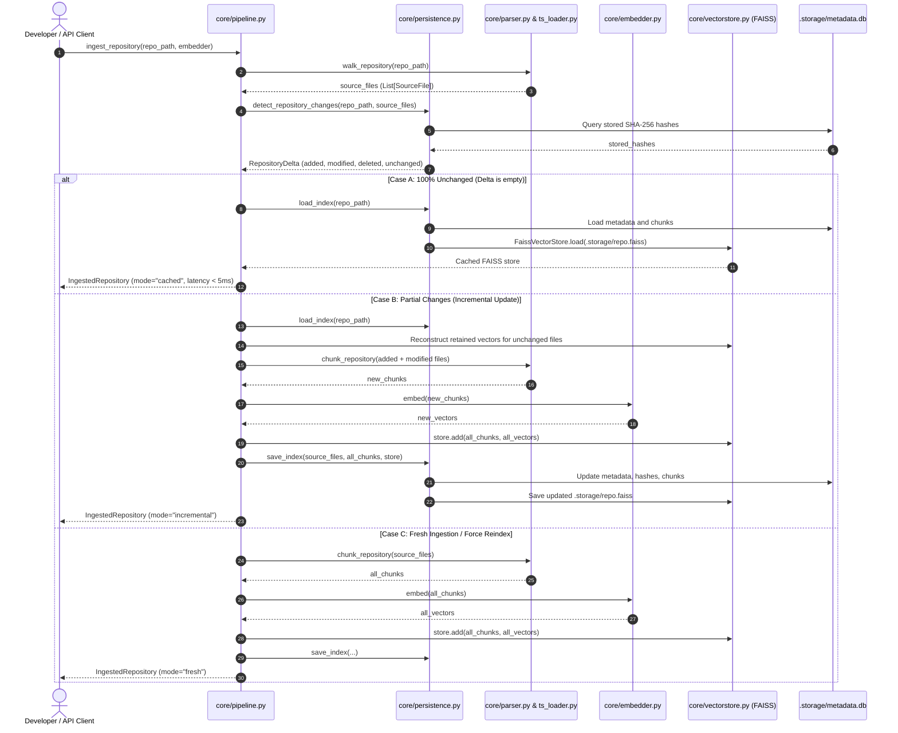
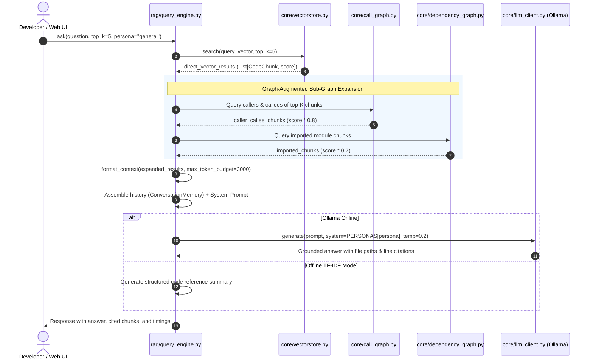
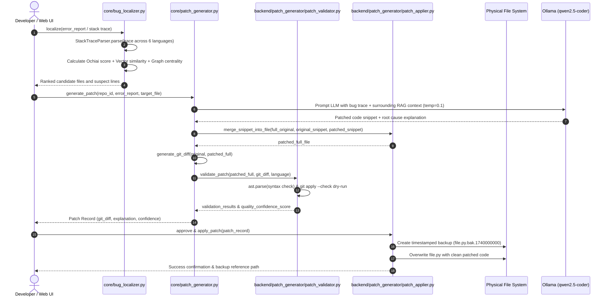
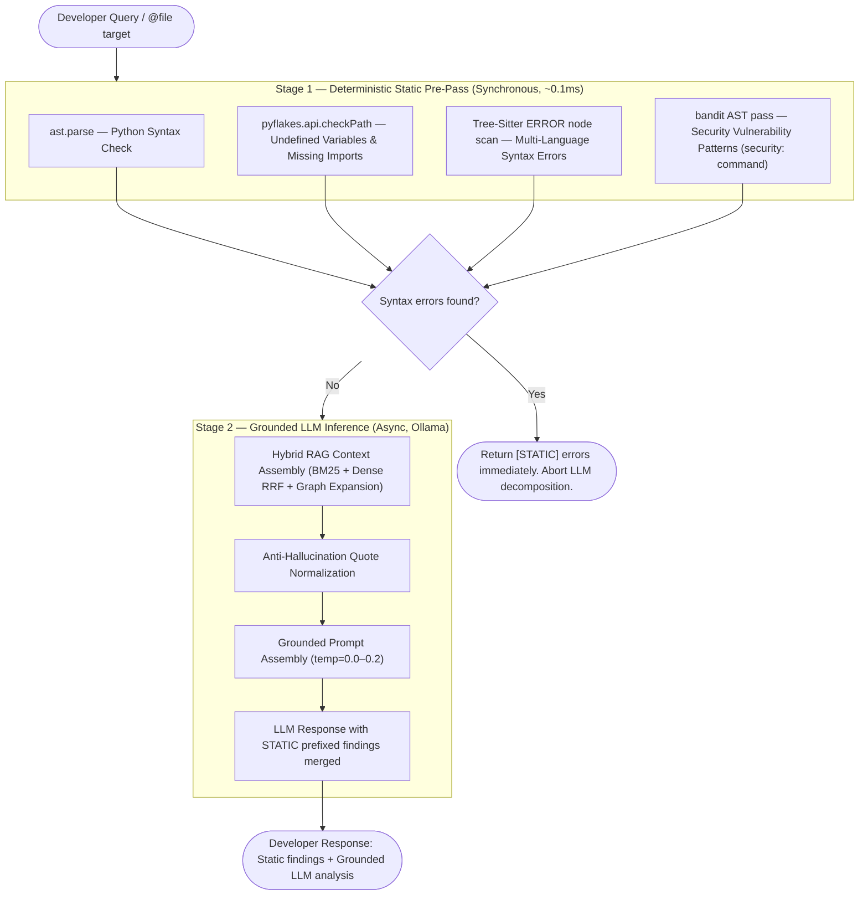

# IntelliCodeX — System Architecture & Technical Design

> **Document Version**: 1.0.0  
> **Status**: Verified & Grounded in Inspected Codebase  
> **Repository Target**: `intellicodex`

---

## 1. Architectural Overview & System Decomposition

IntelliCodeX is structured as a modular, three-tier local architecture:
1. **Presentation Layer**: Interactive Terminal UI ([`cli.py`](../cli.py)) serving as the primary developer interface for Semester 1. Full Web Application UI is preserved in the Semester 2 roadmap.
2. **Application & Service Layer**: Modular FastAPI REST server ([`backend/main.py`](../backend/main.py)) providing endpoints for authentication, repository management, RAG chat, bug localization, patch generation, graph topology, analytics, and documentation.
3. **Core Intelligence & Storage Layer**: High-performance multi-language Tree-Sitter AST parsers, NetworkX dependency and call-graph engines, dual embedding generators (`OllamaEmbedder` + `TfidfEmbedder`), FAISS vector index, SQLite metadata store (`.storage/metadata.db`), and local disk store (`.storage/db.json`).

```mermaid
graph TD
    subgraph Presentation_Layer [Presentation Layer (Active: CLI)]
        CLI["Interactive CLI (cli.py)"]
        WebUIFuture["[Future Phase] React / Next.js Web UI"]
    end

    subgraph Service_Layer [Service & API Layer (FastAPI)]
        MainAPI["backend/main.py (Port 8000)"]
        AuthRouter["/api/auth (JWT)"]
        RepoRouter["/api/repos (Ingest/Sync)"]
        ChatRouter["/api/chat (RAG Assistant)"]
        BugRouter["/api/bugs (Ochiai SBFL)"]
        PatchRouter["/api/patches (Diff Engine)"]
        GraphRouter["/api/graph (Cytoscape Export)"]
        AnalyticsRouter["/api/analytics"]
        DocRouter["/api/docs"]
        ReviewRouter["/api/review"]
    end

    subgraph Core_Engine [Core Intelligence Engine]
        Parser["core/parser.py & core/ts_loader.py"]
        TSChunker["core/tree_sitter_chunker.py"]
        DepGraph["core/dependency_graph.py (NetworkX)"]
        CallGraph["core/call_graph.py (NetworkX)"]
        DualEmbedder["core/embedder.py (Ollama / TF-IDF)"]
        QueryEngine["rag/query_engine.py"]
        BugLocalizer["core/bug_localizer.py (Ochiai + Trace)"]
        PatchEngine["core/patch_generator.py & patch_applier.py"]
    end

    subgraph Persistence_Layer [Persistence & Cache Layer]
        SQLiteDB[".storage/metadata.db (SQLite)"]
        FAISSIndex[".storage/*.faiss (FAISS Binary)"]
        DiskStore[".storage/db.json (Local JSON Store)"]
        MongoDB["MongoDB (Optional Daemon)"]
    end

    subgraph External_Local_Services [External Local Daemon]
        OllamaServer["Local Ollama Server (Port 11434)<br/>• qwen2.5-coder<br/>• nomic-embed-text"]
    end

    CLI --> Core_Engine
    WebUIFuture -.-> MainAPI
    MainAPI --> AuthRouter & RepoRouter & ChatRouter & BugRouter & PatchRouter & GraphRouter & AnalyticsRouter & DocRouter & ReviewRouter
    LegacyBridge --> MainAPI
    RepoRouter & ChatRouter & BugRouter & PatchRouter --> Core_Engine
    Core_Engine --> SQLiteDB & FAISSIndex
    MainAPI --> DiskStore
    DiskStore -.-> MongoDB
    DualEmbedder -.-> OllamaServer
    QueryEngine -.-> OllamaServer
    PatchEngine -.-> OllamaServer
```

---

## 2. Technology Stack & Entry Points

### 2.1 Technology Stack Matrix

| Subsystem | Technology / Library | Version | Role in Architecture |
| :--- | :--- | :--- | :--- |
| **Runtime** | Python | `>= 3.10` (Tested on 3.12/3.14) | Core backend, pipeline, and CLI execution |
| **Primary Interface**| Interactive CLI (`cli.py`) | Version 1.0.0-sem1 | Interactive terminal assistant, batch query, benchmarks |
| **API Server** | FastAPI, Uvicorn, Pydantic | `fastapi>=0.110`, `uvicorn>=0.27` | High-throughput async REST server |
| **AST Parsers** | Tree-Sitter (`tree-sitter-*`) | `tree-sitter>=0.22.0` | Multi-language syntax tree semantic chunking |
| **Vector Index** | FAISS CPU (`faiss-cpu`) | `>= 1.7.4` | Inner-product cosine similarity vector search |
| **Graph DB** | NetworkX (`networkx`) | `>= 3.0` | In-memory directed graphs for imports and call graphs |
| **Embeddings** | Ollama API / Scikit-Learn | `scikit-learn>=1.3` | Dual dense neural + offline TF-IDF SVD fallback |
| **LLM Inference**| Ollama (`qwen2.5-coder`) | Local Server (HTTP 11434) | Grounded RAG synthesis and patch generation |
| **Relational DB**| SQLite3 (`sqlite3`) | Standard Library | File hash caching and chunk relational metadata |
| **Document DB** | PyMongo / Local JSON Store | `pymongo` (optional) | User accounts, chat logs, bug reports, patches |
| **Future Web UI**| React 18, Vite 5, Tailwind CSS | Preserved for Semester 2 | Full web dashboard workspace |

### 2.2 Application Entry Points

1. **Standalone CLI (Primary Interface)**:
   - [`cli.py`](../cli.py)
   - Invocation: `python cli.py [repo_path] [--backend ollama|tfidf]` or Windows launcher [`run_cli.bat`](../run_cli.bat).
2. **FastAPI Backend Server (Local API Server)**:
   - [`backend/main.py`](../backend/main.py)
   - Invocation: `python -m uvicorn backend.main:app --host 127.0.0.1 --port 8000 --reload` or Windows launcher [`run.bat`](../run.bat) (Option 3).
3. **Interactive Launcher**:
   - [`run.bat`](../run.bat) (Menu to launch CLI with Ollama/TF-IDF, Backend Server, Docker, or Install Dependencies).

---

## 3. Detailed Component Architecture & Responsibilities

### 3.1 Code Ingestion & Multi-Language Parsing (`core/parser.py`, `core/ts_loader.py`, `core/tree_sitter_chunker.py`)
- **`walk_repository(repo_path)`**: Recursively traverses the directory tree, applying `.gitignore` filtering rules via fnmatch, filtering binaries, and instantiating `SourceFile` objects.
- **`TreeSitterLoader`**: Dynamically initializes Tree-Sitter language instances for Python, JavaScript, TypeScript, Java, C, C++, Go, and Rust.
- **`TreeSitterChunker`**: Traverses AST nodes, extracting functions, methods, classes, structs, interfaces, and docstrings.
- **`chunk_repository(files)`**: Coordinates Tree-Sitter chunkers across source files, falling back to windowed line chunking for unsupported formats or malformed files.

### 3.2 Graph Analysis Subsystem (`core/dependency_graph.py`, `core/call_graph.py`)
- **`build_dependency_graph(source_files)`**: Uses regex and import visitor logic to detect cross-file imports across ES6 JS/TS (`import ... from '...'`), Java (`import com.pkg.*`), C/C++ (`#include "..."`), and Python (`import x`, `from x import y`).
- **`build_call_graph(chunks, source_files)`**: Analyzes function definitions and body call sites to build directed caller-callee edges between functions.
- **`files_likely_affected_by(graph, file_path)`**: Computes reverse topological reachability to determine the "blast radius" when a file is modified.
- **`get_top_central_files()` / `get_top_central_symbols()`**: Executes PageRank on import and call graphs to identify architectural choke points.

### 3.3 Dual Embedding & Vector Indexing (`core/embedder.py`, `core/vectorstore.py`)
- **`OllamaEmbedder`**: Communicates with `http://localhost:11434/api/embeddings` using model `nomic-embed-text` to produce 768-dimensional dense vectors.
- **`TfidfEmbedder`**: Offline fallback using `TfidfVectorizer` and `TruncatedSVD` (64 dimensions) for zero-dependency CPU environments.
- **`FaissVectorStore`**: Encapsulates `faiss.IndexFlatIP`. Normalizes all vectors with $L_2$ norm before addition and query search, ensuring inner product strictly equals cosine similarity.

### 3.4 Hybrid Persistence Subsystem (`core/persistence.py`, `backend/database/mongo.py`)
- **SQLite Database (`.storage/metadata.db`)**:
  - `repos`: Stores `repo_id`, `repo_path`, `backend`, `total_files`, `total_chunks`, `last_indexed_at`.
  - `files`: Stores `repo_id`, `rel_path`, `file_hash` (SHA-256), `mtime`, `size_bytes`, `line_count`, `language`.
  - `chunks`: Stores `chunk_id`, `repo_id`, `file_path`, `language`, `kind`, `name`, `start_line`, `end_line`, `code`, `docstring`, `imports_json`.
- **FAISS Binary Storage (`.storage/<repo_id>.faiss`)**: Serializes in-memory FAISS indices using `faiss.write_index`.
- **Document Store (`backend/database/mongo.py`)**: Persists application-level entities (`users`, `repositories`, `chat_history`, `bug_reports`, `generated_patches`). Connects to MongoDB if running; otherwise persists atomically to `.storage/db.json`.

---

## 4. End-to-End Execution Workflows

### 4.1 Workflow 1: Incremental Repository Ingestion & Caching


```mermaid
sequenceDiagram
    autonumber
    actor User as Developer / API Client
    participant Pipeline as core/pipeline.py
    participant Persist as core/persistence.py
    participant Parser as core/parser.py & ts_loader.py
    participant Embedder as core/embedder.py
    participant VectorDB as core/vectorstore.py (FAISS)
    participant SQLite as .storage/metadata.db

    User->>Pipeline: ingest_repository(repo_path, embedder)
    Pipeline->>Parser: walk_repository(repo_path)
    Parser-->>Pipeline: source_files (List[SourceFile])
    Pipeline->>Persist: detect_repository_changes(repo_path, source_files)
    Persist->>SQLite: Query stored SHA-256 hashes
    SQLite-->>Persist: stored_hashes
    Persist-->>Pipeline: RepositoryDelta (added, modified, deleted, unchanged)

    alt Case A: 100% Unchanged (Delta is empty)
        Pipeline->>Persist: load_index(repo_path)
        Persist->>SQLite: Load metadata and chunks
        Persist->>VectorDB: FaissVectorStore.load(.storage/repo.faiss)
        VectorDB-->>Pipeline: Cached FAISS store
        Pipeline-->>User: IngestedRepository (mode="cached", latency < 5ms)
    else Case B: Partial Changes (Incremental Update)
        Pipeline->>Persist: load_index(repo_path)
        Pipeline->>VectorDB: Reconstruct retained vectors for unchanged files
        Pipeline->>Parser: chunk_repository(added + modified files)
        Parser-->>Pipeline: new_chunks
        Pipeline->>Embedder: embed(new_chunks)
        Embedder-->>Pipeline: new_vectors
        Pipeline->>VectorDB: store.add(all_chunks, all_vectors)
        Pipeline->>Persist: save_index(source_files, all_chunks, store)
        Persist->>SQLite: Update metadata, hashes, chunks
        Persist->>VectorDB: Save updated .storage/repo.faiss
        Pipeline-->>User: IngestedRepository (mode="incremental")
    else Case C: Fresh Ingestion / Force Reindex
        Pipeline->>Parser: chunk_repository(source_files)
        Parser-->>Pipeline: all_chunks
        Pipeline->>Embedder: embed(all_chunks)
        Embedder-->>Pipeline: all_vectors
        Pipeline->>VectorDB: store.add(all_chunks, all_vectors)
        Pipeline->>Persist: save_index(...)
        Pipeline-->>User: IngestedRepository (mode="fresh")
    end
```

### 4.2 Workflow 2: Context-Grounded Query Answering (RAG)


```mermaid
sequenceDiagram
    autonumber
    actor User as Developer / Web UI
    participant Engine as rag/query_engine.py
    participant VectorDB as core/vectorstore.py
    participant CallGraph as core/call_graph.py
    participant DepGraph as core/dependency_graph.py
    participant LLM as core/llm_client.py (Ollama)

    User->>Engine: ask(question, top_k=5, persona="general")
    Engine->>VectorDB: search(query_vector, top_k=5)
    VectorDB-->>Engine: direct_vector_results (List[CodeChunk, score])
    
    rect rgb(240, 248, 255)
        note over Engine,DepGraph: Graph-Augmented Sub-Graph Expansion
        Engine->>CallGraph: Query callers & callees of top-K chunks
        CallGraph-->>Engine: caller_callee_chunks (score * 0.8)
        Engine->>DepGraph: Query imported module chunks
        DepGraph-->>Engine: imported_chunks (score * 0.7)
    end

    Engine->>Engine: format_context(expanded_results, max_token_budget=3000)
    Engine->>Engine: Assemble history (ConversationMemory) + System Prompt
    
    alt Ollama Online
        Engine->>LLM: generate(prompt, system=PERSONAS[persona], temp=0.2)
        LLM-->>Engine: Grounded answer with file paths & line citations
    else Offline TF-IDF Mode
        Engine->>Engine: Generate structured code reference summary
    end

    Engine-->>User: Response with answer, cited chunks, and timings
```

### 4.3 Workflow 3: Bug Localization, Patch Synthesis, and Safe Disk Application


```mermaid
sequenceDiagram
    autonumber
    actor User as Developer / Web UI
    participant Localizer as core/bug_localizer.py
    participant PatchEngine as core/patch_generator.py
    participant Validator as backend/patch_generator/patch_validator.py
    participant Applier as backend/patch_generator/patch_applier.py
    participant Disk as Physical File System
    participant LLM as Ollama (qwen2.5-coder)

    User->>Localizer: localize(error_report / stack trace)
    Localizer->>Localizer: StackTraceParser.parse(trace across 6 languages)
    Localizer->>Localizer: Calculate Ochiai score + Vector similarity + Graph centrality
    Localizer-->>User: Ranked candidate files and suspect lines

    User->>PatchEngine: generate_patch(repo_id, error_report, target_file)
    PatchEngine->>LLM: Prompt LLM with bug trace + surrounding RAG context (temp=0.1)
    LLM-->>PatchEngine: Patched code snippet + root cause explanation
    PatchEngine->>Applier: merge_snippet_into_file(full_original, original_snippet, patched_snippet)
    Applier-->>PatchEngine: patched_full_file
    PatchEngine->>PatchEngine: generate_git_diff(original, patched_full)
    PatchEngine->>Validator: validate_patch(patched_full, git_diff, language)
    Validator->>Validator: ast.parse(syntax check) & git apply --check dry-run
    Validator-->>PatchEngine: validation_results & quality_confidence_score
    PatchEngine-->>User: Patch Record (git_diff, explanation, confidence)

    User->>Applier: approve & apply_patch(patch_record)
    Applier->>Disk: Create timestamped backup (file.py.bak.1740000000)
    Applier->>Disk: Overwrite file.py with clean patched code
    Applier-->>User: Success confirmation & backup reference path
```

---

## 5. Security & Isolation Boundaries

1. **Local LLM Processing**:
   - All RAG query formatting, embedding calculations, and LLM inferences communicate exclusively with localhost (`http://localhost:11434` or in-memory Scikit-Learn/FAISS).
   - No code snippets, file paths, or telemetry are transmitted over the public internet.
2. **Local Authentication & Authorization**:
   - Access tokens are signed with HMAC-SHA256 (`HS256`) using a locally configured `JWT_SECRET` from environment or auto-generated to `.storage/jwt_secret.key`.
   - Passwords are hashed using Argon2 (bcrypt-compatible) before persistence.
   - Owner scoping ensures users can only access their own resources.
   - Login rate limiting is keyed by (username, client IP) with TRUSTED_PROXIES support for reverse proxy deployments.
   - **Migration Note**: Existing users from before the Argon2 hashing change must re-register.
3. **Defensive File Modification Safeguards**:
   - All physical file writes create atomic `.bak.<timestamp>` backup files before overwriting.
   - Patch syntax is verified via AST parsing before application. If an error occurs during file writing, status is reverted to prevent disk corruption.
4. **Sandbox Test Execution Security**:
   - **Local Mode (default)**: Tests run as your user with filesystem and network access. Environment variables are filtered (only PATH, SYSTEMROOT, TEMP, TMP, COMSPEC, PATHEXT, LANG, LC_ALL, HOME, USERPROFILE, PYTHONPATH, PYTHONDONTWRITEBYTECODE are passed). Variables matching *KEY*, *TOKEN*, *SECRET*, *PASSWORD*, *CREDENTIAL* are blocked. Shell execution is disabled; only allowlisted executables (python, pytest, npm, npx, node, go, cargo, mvn, gradle) are permitted. Shell metacharacters are rejected. Process tree is killed on timeout (children first, then parent). Output is truncated at 1 MB to prevent resource exhaustion. Memory use stays bounded regardless of child output size.
   - **Docker Mode (Implemented, unverified)**: Tests run in a container with `--network none`, memory/CPU limits, read-only rootfs, PID limits, dropped capabilities (--cap-drop ALL), no new privileges (--security-opt no-new-privileges), and non-root user (1000:1000). Provides strong isolation for untrusted code. Requires Docker. Falls back to local mode with a logged warning if Docker is unavailable. Mock tests verify Docker detection and fallback behavior, but actual container test execution is not verified (default image lacks pytest).
   - **API Security**: User-supplied test commands are only accepted from admin users. Local sandbox mode is disabled by default in API mode unless `ALLOW_LOCAL_SANDBOX=true` is set. This prevents API users from running arbitrary code on the server.
   - **Test Result Reporting**: Skipped sandbox results are reported as "not verified" (never as "validated" or "tests passed"). CLI displays "NOT VERIFIED: NO TESTS RAN" when tests are skipped. API payload returns `verified: false` when tests are skipped.
   - **WARNING**: Local mode is NOT true isolation. Use only on repositories you trust. For untrusted repositories, ALWAYS use Docker mode by setting `SANDBOX_MODE=docker`. The default Docker image lacks pytest and dependencies; build a custom image for production use (see README.md for example).

---

## 6. Current vs. Proposed Architecture Boundaries

| Feature Component | Current Implemented Architecture | Proposed Future Architecture |
| :--- | :--- | :--- |
| **AST Chunking** | Tree-Sitter grammars (8 languages) with windowed fallback | Full semantic symbol table cross-referencing and type inference |
| **Patch Workflow** | Single-shot synthesis $\rightarrow$ AST check $\rightarrow$ Git Diff $\rightarrow$ Safe Applier | Autonomous multi-turn test-driven repair loop (`pytest` feedback loop) |
| **Sync Mechanism** | On-demand CLI/API sync + Git commit hooks (`core/git_hooks.py`) | Background in-memory filesystem watcher daemon (`watchdog`) |
| **Vector Storage** | Local FAISS CPU index binary (`.faiss`) | Optional connectors for remote Qdrant / Milvus / ChromaDB clusters |
| **Analytics UI** | Re-renders `DashboardPage` in `AnalyticsPage.tsx` | Dedicated charts for cyclomatic complexity, Halstead, and risk index |

---

## 7. Operational Limits & Production Deployment

### 7.1 Single-Process Concurrency & Inference Serialization
- **Single-Process Model**: IntelliCodeX FastAPI runs on Uvicorn in a single-process event loop architecture. Global in-memory locks (`_GLOBAL_OLLAMA_THREAD_LOCK`) serialize access to the local Ollama LLM (`11434`), protecting VRAM from concurrency crashes or timeouts while queuing parallel incoming client requests safely.
- **In-Memory Rate Limiting**: The authentication router applies an in-memory sliding window rate limiter (maximum 5 failed attempts per 5 minutes per user/IP). Because rate-limiting state is in-process, deploying multiple Uvicorn worker processes without a distributed Redis backend is not recommended.

### 7.2 Reverse-Proxy & TLS/HTTPS Recommendation
- The FastAPI application binds by default to `127.0.0.1:8000` without TLS encryption.
- **Production Architecture**: When deploying IntelliCodeX across internal networks or teams, it MUST be fronted by an NGINX or Caddy reverse proxy providing:
  1. **TLS Termination**: HTTPS certificates (Let's Encrypt or corporate CA).
  2. **Security Headers**: HSTS, Content-Security-Policy, and X-Content-Type-Options.
  3. **Client IP Forwarding**: Pass `X-Forwarded-For` and `X-Real-IP` to enable accurate client IP tracking (configured via `settings.TRUSTED_PROXIES`).
  4. **Timeout Configuration**: Ensure proxy upstream timeouts are set to at least `300s` (`proxy_read_timeout 300;`) to accommodate serialized local LLM inference over large codebases.

### 7.3 Remote CLI Client-Server Protocol
- Developers can interact with a centralized team server from the terminal using the CLI remote bridge:
  ```bash
  python cli.py repo_name --server https://intellicodex.internal --token <JWT_TOKEN>
  ```
- All AST graph navigation, embedding lookups, and bug localization execute on the central server and stream results back to the remote CLI client over `/api` REST endpoints.

---

## 8. Hybrid Deterministic Static Analysis + LLM Inference Architecture

IntelliCodeX implements a **deterministic-first, LLM-second** inference pipeline. Static analyzers run synchronously before any LLM token is generated. This design guarantees reproducibility for syntax-class defects, eliminates a class of hallucinations, and keeps LLM costs proportional to query complexity.

### 8.1 Two-Stage Pipeline


```mermaid
flowchart TD
    Input(["Developer Query / @file target"])

    subgraph Stage1 ["Stage 1 — Deterministic Static Pre-Pass (Synchronous, ~0.1ms)"]
        S1A["ast.parse — Python Syntax Check"]
        S1B["pyflakes.api.checkPath — Undefined Variables & Missing Imports"]
        S1C["Tree-Sitter ERROR node scan — Multi-Language Syntax Errors"]
        S1D["bandit AST pass — Security Vulnerability Patterns (security: command)"]
    end

    subgraph Stage2 ["Stage 2 — Grounded LLM Inference (Async, Ollama)"]
        S2A["Hybrid RAG Context Assembly (BM25 + Dense RRF + Graph Expansion)"]
        S2B["Anti-Hallucination Quote Normalization"]
        S2C["Grounded Prompt Assembly (temp=0.0–0.2)"]
        S2D["LLM Response with STATIC prefixed findings merged"]
    end

    Input --> Stage1
    S1A & S1B & S1C & S1D --> Decision{"Syntax errors found?"}
    Decision -- "Yes" --> EarlyReturn(["Return [STATIC] errors immediately. Abort LLM decomposition."])
    Decision -- "No" --> Stage2
    S2A --> S2B --> S2C --> S2D
    S2D --> Output(["Developer Response: Static findings + Grounded LLM analysis"])
```

### 8.2 Stage 1 — Static Analysis Pre-Pass

| Analyzer | Scope | Defects Caught | Latency |
| :--- | :--- | :--- | :---: |
| `ast.parse` | Python | Syntax errors (SyntaxError, IndentationError) | ~0.05ms |
| `pyflakes.api.checkPath` | Python | Undefined variables, unused imports, missing imports | ~0.1ms |
| Tree-Sitter `ERROR` node scan | 9 languages | Language-agnostic syntax tree corruption markers | ~0.5ms |
| `bandit` AST pass | Python (`security:` cmd) | OWASP Top-10 Python patterns (hardcoded secrets, SQL injection, shell injection) | ~50ms |

**Key property**: Stage 1 runs with **zero code execution** — only AST traversal and static pattern matching. No subprocess is spawned.

### 8.3 Stage 2 — Grounded LLM Inference

LLM inference is invoked **only when Stage 1 finds no syntax-blocking errors**. All prompts are assembled with:

1. **RAG Context**: Top-K code chunks retrieved via Hybrid BM25 + Dense RRF, expanded with call-graph callers (score ×0.8) and import dependencies (score ×0.7), bounded by a 3000-token budget.
2. **Quote Normalization**: Before any LLM claim is accepted, cited code snippets are normalized (stripped of `N |` line-number prefixes, code fences, and leading/trailing whitespace) and matched against the ground-truth source file. Unmatched quotes are rejected and logged under `INTELLICODEX_DEBUG_PROMPT`.
3. **Temperature Control**: Bug analysis uses `temperature=0.0` for maximum determinism; general Q&A and documentation generation use `temperature=0.2`.
4. **Label Merging**: Static findings (`[STATIC]`) are prepended to LLM output to present a unified, prioritized report.

### 8.4 Design Rationale

| Design Decision | Reason |
| :--- | :--- |
| Static before LLM | Syntax errors make LLM-level reasoning unreliable; abort early saves tokens and is always correct |
| Quote filter before acceptance | Prevents LLM from fabricating line numbers or code that does not exist in the actual file |
| Single whole-file context prompt | Avoids repetitive per-function round-trips which multiply inference latency on CPU/7B models |
| Strict `temperature=0.0` for bug analysis | Reproducible outputs allow benchmark comparisons across runs |
| `[STATIC]` label prefix | Communicates to developers which findings are deterministic vs. probabilistic |
