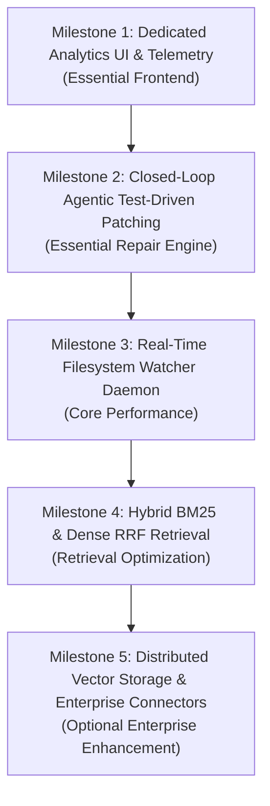

# IntelliCodeX — Project Engineering Roadmap

> **Status**: Active  
> **Last Updated**: 2026-09-17  
> **Scope**: Essential Enhancements & Future Strategic Milestones

---

## 1. Prioritized Milestones & Dependency Flow

---

## 2. Milestone 1: Dedicated Analytics UI & Telemetry Dashboard `[ESSENTIAL]`

* **Goal**: Replace the wrapper in `frontend/src/pages/AnalyticsPage.tsx` with dedicated visual charts for repository health, code complexity, and patch efficiency.
* **Target Priority**: High (P1)
* **Dependencies**: None (FastAPI `/api/analytics/{repo_id}` endpoint already returns required metrics).

### Tasks:
1. **Task 1.1: Build Standalone Analytics Page Components**
   - **File**: [`frontend/src/pages/AnalyticsPage.tsx`](file:///c:/Users/vikas/Downloads/Major%20project%202%202026/intellicodex/frontend/src/pages/AnalyticsPage.tsx)
   - **Description**: Replace the `<DashboardPage />` render delegation with a dedicated multi-card analytics view.
   - **Owner**: Unassigned
   - **Estimated Effort**: ~1-2 days (Estimate)
   - **Completion Criteria**: Page renders language breakdown, node/edge density, health score cards, and circular dependency tables independently.
2. **Task 1.2: Integrate Chart Visualizations**
   - **Description**: Add visual progress bars or SVG/canvas chart components for language distribution and complexity distribution.
   - **Owner**: Unassigned
   - **Estimated Effort**: ~1 day (Estimate)
   - **Completion Criteria**: Visual rendering verified in browser without console warnings.

---

## 3. Milestone 2: Closed-Loop Agentic Test-Driven Repair (Self-Healing Code) `[ESSENTIAL]`

* **Goal**: Enhance the patch generation pipeline from single-shot LLM prompting into an iterative, test-validated repair loop.
* **Target Priority**: High (P1)
* **Dependencies**: Milestone 1, `core/patch_generator.py`.

### Tasks:
1. **Task 2.1: Sandbox Test Execution Runner**
   - **File**: `core/sandbox_runner.py` (New)
   - **Description**: Execute repository test suites (`pytest`, `npm test`) inside an isolated temporary directory applying the proposed patch.
   - **Owner**: Unassigned
   - **Estimated Effort**: ~2-3 days (Estimate)
   - **Completion Criteria**: Test execution captures exit codes, failed test names, assertion failures, and tracebacks.
2. **Task 2.2: Multi-Turn Self-Correction Prompt Loop**
   - **File**: [`core/patch_generator.py`](file:///c:/Users/vikas/Downloads/Major%20project%202%202026/intellicodex/core/patch_generator.py)
   - **Description**: If sandboxed tests fail, feed the failing test assertions and stack trace back into `qwen2.5-coder` (up to a configurable maximum of 3 iterations).
   - **Owner**: Unassigned
   - **Estimated Effort**: ~2 days (Estimate)
   - **Completion Criteria**: Patch engine automatically re-attempts fixes upon test failure and marks patch as `test_passed` or `max_iterations_exceeded`.

---

## 4. Milestone 3: Real-Time Filesystem Watcher Daemon `[CORE PERFORMANCE]`

* **Goal**: Synchronize modified code chunks in real-time in the background without requiring manual CLI re-indexing or server restarts.
* **Target Priority**: Medium (P2)
* **Dependencies**: `core/pipeline.py`, `backend/services/incremental_indexer.py`.

### Tasks:
1. **Task 3.1: Watchdog Background Observer Integration**
   - **File**: [`backend/services/incremental_indexer.py`](file:///c:/Users/vikas/Downloads/Major%20project%202%202026/intellicodex/backend/services/incremental_indexer.py)
   - **Description**: Implement a thread-safe `watchdog.observers.Observer` monitoring active repository directories for `on_modified`, `on_created`, and `on_deleted` file events with debouncing (500ms).
   - **Owner**: Unassigned
   - **Estimated Effort**: ~2 days (Estimate)
   - **Completion Criteria**: Saving a file in `sample_repo` triggers selective re-embedding and FAISS index update in $<200\text{ms}$.

---

## 5. Milestone 4: Hybrid BM25 & Dense Reciprocal Rank Fusion (RRF) `[RETRIEVAL OPTIMIZATION]`

* **Goal**: Combine sparse lexical keyword matching (BM25) with dense vector cosine similarity (FAISS) using Reciprocal Rank Fusion to maximize retrieval recall on exact variable and symbol lookups.
* **Target Priority**: Medium (P2)
* **Dependencies**: `core/vectorstore.py`, `rag/query_engine.py`.

### Tasks:
1. **Task 4.1: BM25 Lexical Indexer**
   - **File**: `core/lexical_index.py` (New)
   - **Description**: Inverted index for exact symbol and token matching across code chunks.
   - **Owner**: Unassigned
   - **Estimated Effort**: ~2 days (Estimate)
   - **Completion Criteria**: Benchmark retrieval accuracy shows $>10\%$ improvement in Mean Reciprocal Rank (MRR) for exact variable name queries.
2. **Task 4.2: Reciprocal Rank Fusion (RRF) Scorer**
   - **File**: [`rag/query_engine.py`](file:///c:/Users/vikas/Downloads/Major%20project%202%202026/intellicodex/rag/query_engine.py)
   - **Description**: Merge rankings via $\text{RRF}(d) = \sum_{m \in M} \frac{1}{k + r_m(d)}$.
   - **Owner**: Unassigned
   - **Estimated Effort**: ~1 day (Estimate)
   - **Completion Criteria**: Combined ranked results returned to query engine.

---

## 6. Milestone 5: Distributed Vector Storage & Enterprise Connectors `[OPTIONAL ENHANCEMENT]`

* **Goal**: Provide modular drivers for enterprise codebases exceeding 100,000 files and team CI/CD pull request automations.
* **Target Priority**: Low (P3 / Future Research)
* **Dependencies**: Core v1.0.0 stability.

### Tasks:
1. **Task 5.1: External Vector Store Adapters (Qdrant / Milvus)**
   - **Owner**: Unassigned
   - **Estimated Effort**: ~3-4 days (Estimate)
2. **Task 5.2: GitHub / GitLab Webhook Automated PR Review Bot**
   - **Owner**: Unassigned
   - **Estimated Effort**: ~3 days (Estimate)
